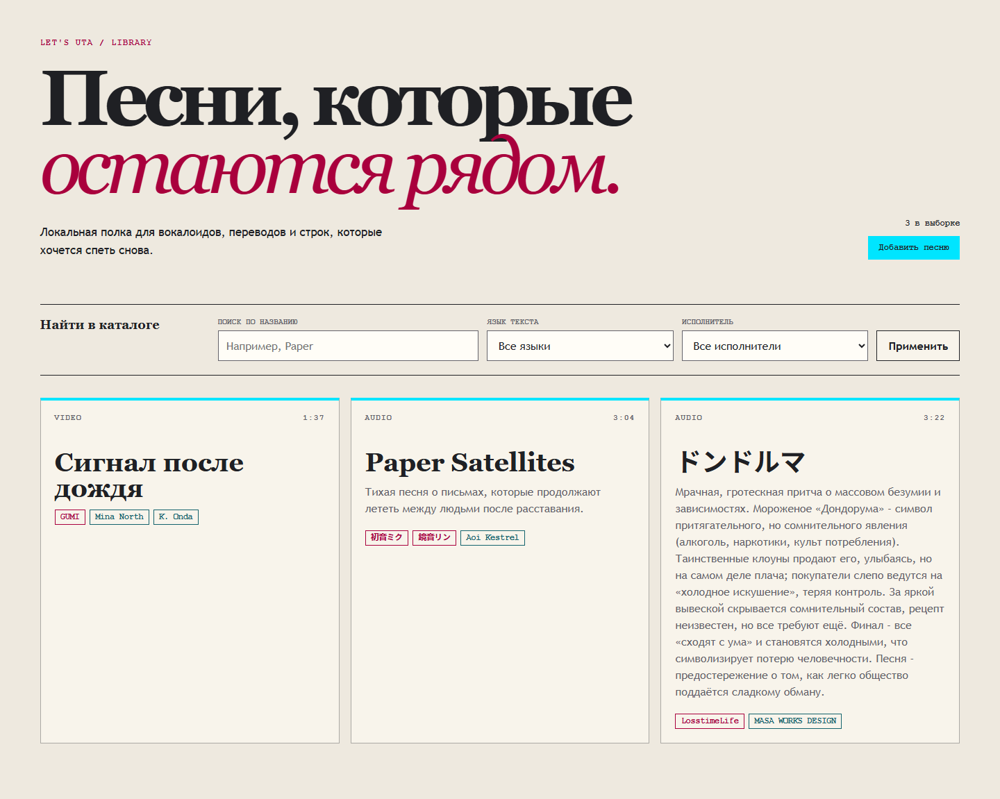
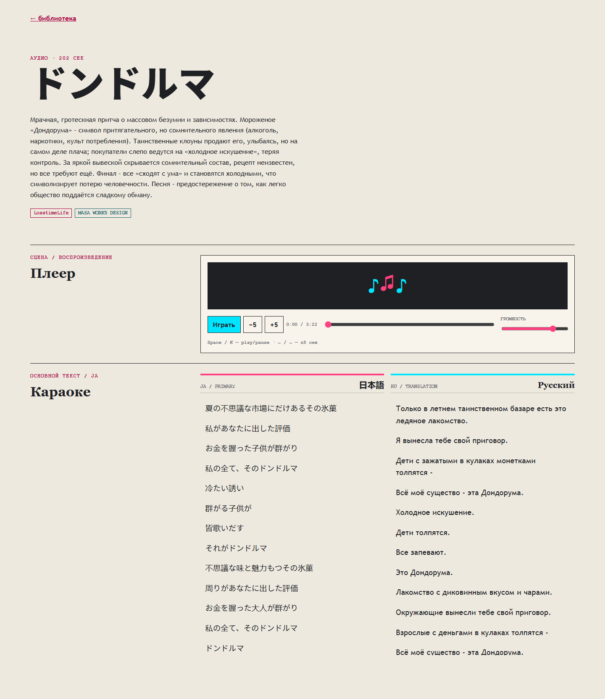
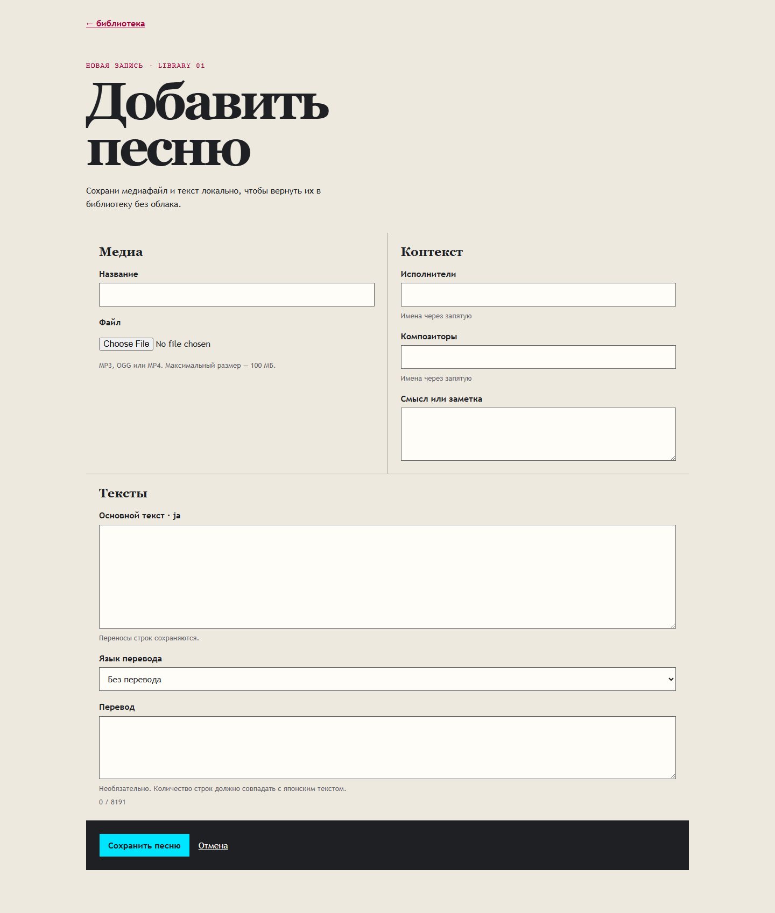

<div align="center">

# 🎤 Lets Uta!

<p>
  Локальный караоке-медиаплеер для вокалоидов: библиотека, upload, playback, общий timing для `ja` и асинхронный перевод без облака.
</p>

[](https://nodejs.org)
[](https://svelte.dev)
[](https://kit.svelte.dev)
[](https://www.typescriptlang.org)
[](https://sqlite.org)
[](https://ffmpeg.org)
[](LICENSE)

</div>

## Что уже есть

- Локальная библиотека песен с фильтрами по title, language и artist.
- Upload для MP3, OGG и MP4 с безопасным сохранением файлов в data root.
- Playback page с discrete karaoke highlighting и hotkeys.
- Primary `ja` lyric и один secondary `ru` или `en`.
- Асинхронное добавление перевода через отдельный action.
- Shared timings: перевод использует тот же `lineIndex`, что и основной текст.

## Скриншоты

| Библиотека                                                                             | Playback                                                                                |
| :------------------------------------------------------------------------------------- | :-------------------------------------------------------------------------------------- |
|  |  |

| Upload                                                                            |     |
| :-------------------------------------------------------------------------------- | :-- |
|  |     |

## Технологии

- Node.js 22+
- SvelteKit 2
- Svelte 5 Runes
- TypeScript strict
- `@sveltejs/adapter-node`
- `better-sqlite3`
- SQLite WAL
- FFmpeg
- `onnxruntime-node`
- Vitest, Playwright, ESLint, Prettier, `svelte-check`, Knip, `fast-check`

## Скрипты

```bash
npm install
npm run setup
npm run seed
npm run dev
npm run build
npm run preview
npm run test:unit
npm run test:integration
npm run test:e2e
npm run gate
```

## Текущий фокус

- Stage 3.1: playback и translation
- Stage 4: async Forced Alignment
- Stage 5: manual timing editor
- Stage 6: editing, settings, export/import

## Автор

MindlessMuse666

## Лицензия

GNU General Public License v3.0, см. [LICENSE](LICENSE).
