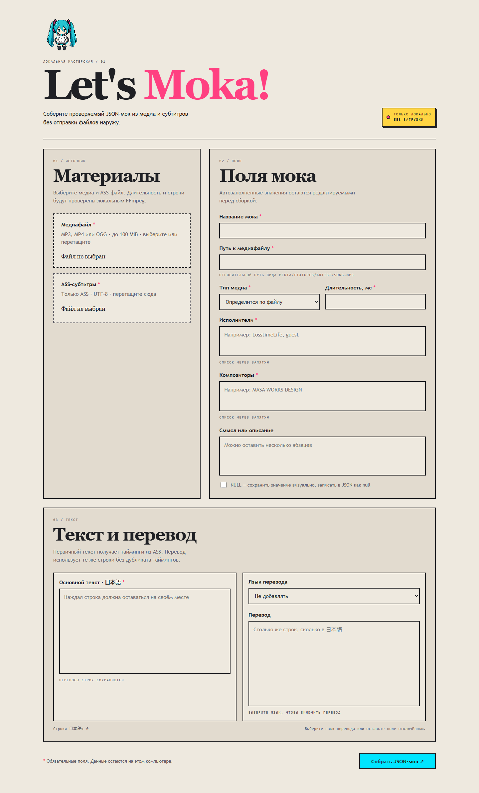
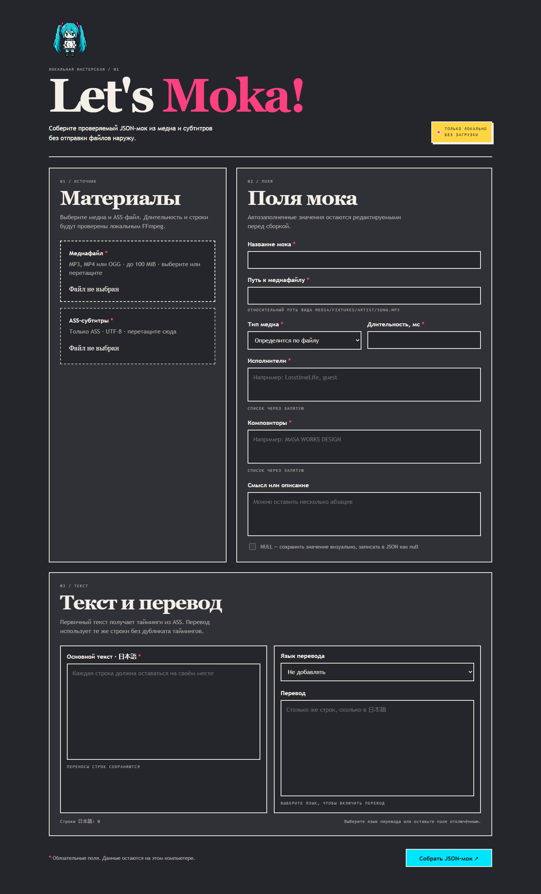

<div align="center">

# Let's Moka!

<p>
  Локальный генератор JSON-моков для проверки медиа, ASS-текста и таймингов
  в формате <code>lets-uta</code>.
</p>


</div>

`Let's Moka!` — самостоятельное служебное web-приложение для системных аналитиков и тестировщиков. Оно принимает MP3, MP4 или OGG вместе с ASS-файлом, локально получает metadata через `ffprobe` и показывает готовый JSON-массив из одной песни.

Файлы не отправляются во внешние сервисы и не сохраняются после обработки запроса. Приложение не использует Node.js, SvelteKit, SQLite или код основного `lets-uta`.

## Скриншоты

|                                          Светлая тема                                           |                                          Тёмная тема                                          |
| :---------------------------------------------------------------------------------------------: | :-------------------------------------------------------------------------------------------: |
|  |  |

Форма поддерживает выбор через проводник и drag & drop. Primary Japanese text и перевод расположены рядом, автоматически растут по содержимому и показывают общий счётчик строк: несовпадение выделяется красной рамкой, совпадение — жёлтой и надписью `Let's Mock!`.

## Возможности

- извлечение длительности, типа медиа и доступных тегов через системный `ffprobe`;
- разбор ASS с BOM, `\\N`, Unicode и запятыми внутри текста;
- единый набор импортированных таймингов для primary `ja`;
- необязательный перевод `ru` или `en` без дублирования таймингов;
- drag & drop для MP3, MP4, OGG и ASS с фильтрацией расширений в file picker;
- сохранение выбранных файлов после ошибки генерации без повторной загрузки;
- автоматическое имя каталога `filePath` из исполнителя metadata с заменой пробелов и запятых на `-`;
- автоподстройка высоты `meaning`, Japanese text и translation; перевод отключается при `Не добавлять`;
- проверка `filePath`, длительности, числа строк и nullable-поля `meaning`;
- readable preview, копирование JSON и скачивание UTF-8-файла `<title>.json`;
- responsive-интерфейс с keyboard-only навигацией, видимым focus и режимом reduced motion.

## Требования

- Go `1.25+`;
- системный FFmpeg с доступной в `PATH` командой `ffprobe`;
- браузер с поддержкой стандартных File API и Clipboard API.

Проверить окружение можно так:

```bash
go version
ffprobe -version
```

## Запуск

Из корня репозитория:

```bash
cd lets-moka
go run ./cmd/lets-moka
```

Откройте <http://127.0.0.1:8080>. Для standalone-бинарника:

```bash
cd lets-moka
go build -o lets-moka ./cmd/lets-moka
./lets-moka
```

На Windows имя собранного файла можно заменить на `lets-moka.exe`.

### Сборка `.exe` на Windows

Откройте PowerShell в каталоге `lets-moka` и выполните:

```powershell
go build -o lets-moka.exe ./cmd/lets-moka
```

В результате появится самостоятельный `lets-moka.exe`. Для запуска рядом с ним должен быть доступен системный `ffprobe` из FFmpeg:

```powershell
.\lets-moka.exe
```

Для сборки Windows-бинарника на другой ОС используйте cross-compilation:

```bash
GOOS=windows GOARCH=amd64 go build -o lets-moka.exe ./cmd/lets-moka
```

UI и брендовые assets уже встроены в бинарник; отдельно копировать `web/`, `favicon.ico` или логотип не требуется.

## Сценарий генерации

1. Выберите медиафайл MP3, MP4 или OGG.
2. Проверьте автоматически заполненные название, путь, тип, длительность и tags.
3. Выберите ASS-файл и при необходимости исправьте основной текст `日本語`.
4. Заполните обязательные поля; перевод задайте как `Русский` или `English`, если он нужен.
5. При необходимости включите `NULL` рядом с полем смысла.
6. Нажмите `Собрать JSON-мок`, проверьте preview, затем скопируйте или скачайте результат.

## Проверки

Все команды выполняются из `lets-moka`:

```bash
gofmt -l .
go vet ./...
go test ./...
go build -o lets-moka ./cmd/lets-moka
```

В GitHub Actions приложение проверяется отдельным workflow `.github/workflows/lets-moka.yml` и не запускает Node pipeline основного проекта.

В репозитории есть детерминированная fixture-песня `HEAVEN`: её ASS и JSON используются в тестах и служат примером японского текста, Unicode-имени файла и общих таймингов.

## Структура

```text
cmd/lets-moka/       standalone HTTP-сервер
internal/ass/        чистый ASS parser
internal/media/      adapter для ffprobe
internal/mock/       доменные типы, validation и JSON builder
internal/web/        HTTP, form state и embedded UI
web/                  HTML, CSS и vanilla JavaScript
```

Брендовые файлы `favicon.ico` и `logo_lets_moka_v1.png` встраиваются в бинарник и доступны только через `/static/*`.

## Лицензия и автор

Проект распространяется по лицензии [GNU General Public License v3.0](../LICENSE).

Автор: [MindlessMuse666](https://github.com/MindlessMuse666).

<div align="center">
  
  <br>
  <sub><b>Let's Moka! // Генератор JSON-моков</b></sub>
  <br>
  <sup><i>made with ❤️ by <a href="https://github.com/MindlessMuse666" target="_blank">MindlessMuse666</a></i></sup>
</div>
